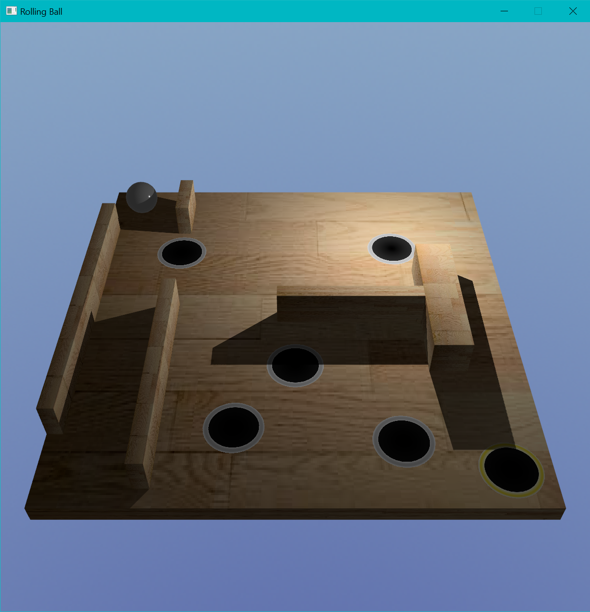
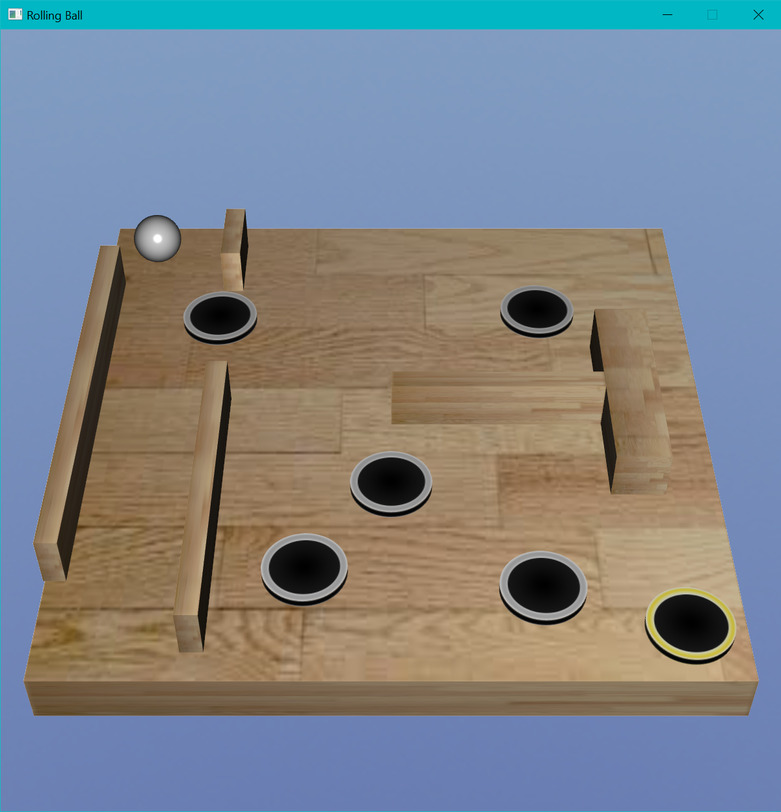
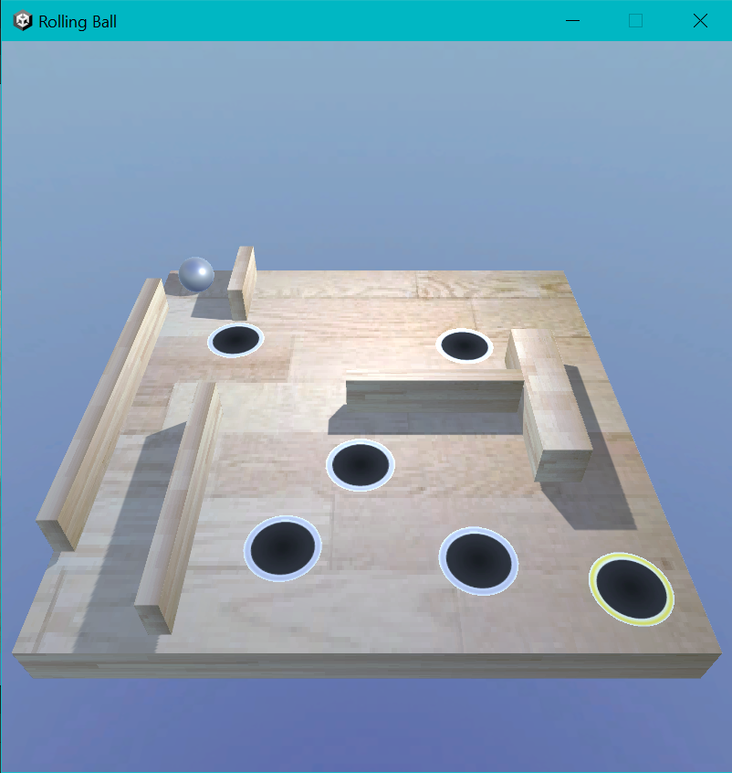

# Comparison of 3D Game Development Tools

A comprehensive comparative study of three different technologies for 3D game development: JavaFX, Bevy, and Unity 3D.

## Overview

This repository contains the complete materials for a bachelor's thesis that compares three different approaches to developing 3D video games. The study implements the same 3D labyrinth ball game in three different technologies and evaluates them across multiple metrics.

## 🎯 Project Goal

To provide empirical data and practical insights for developers choosing between different 3D game development tools, particularly for educational purposes and independent game development.

## 🎮 The Game

All three implementations feature a 3D labyrinth ball game inspired by classic wooden puzzle toys:

- **Objective**: Guide a ball through a tilting wooden labyrinth to reach the goal hole
- **Controls**: Keyboard input to tilt the platform, mouse controls for camera
- **Features**: Physics simulation, collision detection, textures, lighting, win conditions
- **Visual Elements**: Skybox backgrounds, textured materials, multiple camera modes





## 📊 Comparative Study Results

### Technology Comparison Matrix

| Metric | JavaFX | Bevy | Unity 3D |
|--------|--------|------|----------|
| **Development Time** | 31 hours | 41 hours | 22 hours |
| **Lines of Code** | 812 | 1,094 | 201 |
| **Executable Size** | 84.3 MB | 21.8 MB | 71.7 MB |
| **Memory Usage** | 143.8 MB | 114.0 MB | 76.9 MB |
| **Platform Support** | 8 | 4+2 | 22 |
| **User Rating (Graphics)** | 5.95/10 | 8.81/10 | 8.33/10 |
| **User Rating (Overall)** | 6.14/10 | 8.52/10 | 8.38/10 |

### Key Findings

- **Unity 3D**: Fastest development, extensive platform support, industry-standard tools
- **Bevy**: Most efficient executable, modern architecture, memory-safe development
- **JavaFX**: Educational value, cross-platform Java ecosystem, middle-level abstraction

## 📁 Repository Structure

```
├── implementations/
│   ├── unity_dissertation/          # Unity 3D implementation
│   ├── bevy_dissertation/           # Bevy (Rust) implementation
│   └── javafx_dissertation/         # JavaFX (Java) implementation
├── thesis/
│   ├── thesis.pdf                     # Complete thesis document (Serbian)
│   └── thesis-summary-en.md           # English summary
└── README.md                          # This file
```

## 🚀 Quick Start

### Clone with Submodules
```bash
git clone --recursive https://github.com/uros117/3d-game-development-comparison.git
cd 3d-game-development-comparison
```

### Try Each Implementation

#### Unity 3D
```bash
cd implementations/unity_dissertation
# Open in Unity Hub and press Play
```

#### Bevy (Rust)
```bash
cd implementations/bevy_dissertation
cargo run
```

#### JavaFX (Java)
```bash
cd implementations/javafx_dissertation
./gradlew run
```

## 📋 Evaluation Metrics

### Developer-Focused Metrics
- **Abstraction Level**: High, Medium, Low
- **Source Code Size**: Files, classes, methods, lines of code
- **Project Size**: Total project folder size
- **Development Time**: Engineer-hours spent
- **Tool Comfort**: Subjective usability rating (1-10)

### User-Focused Metrics
- **Executable Size**: Final application size
- **Memory Performance**: RAM usage during gameplay
- **Platform Support**: Number of supported platforms
- **Quality Assessment**: User survey results on graphics, responsiveness, overall experience

## 🎓 Academic Context

**Institution**: University of Belgrade - Faculty of Electrical Engineering  
**Department**: Computer Engineering and Informatics  
**Thesis Title**: "Poređenje alata za razvoj 3D video igara u tehnologijama JavaFX, Bevy i Unity 3D"  
**Author**: Uroš Filipović (2018/0663)  
**Mentor**: dr Igor Tartalja, v.prof.  
**Year**: 2022  
**Language**: Serbian (with English technical terms)

## 📖 Research Methodology

1. **Functional Specification**: Defined identical game requirements for all implementations
2. **Implementation Phase**: Developed the same game in three different technologies
3. **Metric Collection**: Gathered objective measurements and subjective assessments
4. **User Testing**: Conducted surveys with 21 participants
5. **Comparative Analysis**: Analyzed results across multiple dimensions

## 🔍 Key Technologies Analyzed

### JavaFX
- **Abstraction**: Medium level (requires matrix math knowledge)
- **Flexibility**: Limited (no shader support)
- **Strength**: Educational value, Java ecosystem
- **Weakness**: Limited 3D capabilities

### Bevy
- **Abstraction**: High level (Entity-Component-System)
- **Flexibility**: High (custom shaders, modular plugins)
- **Strength**: Memory safety, modern architecture, performance
- **Weakness**: Young ecosystem, longer development time

### Unity 3D
- **Abstraction**: High level (visual editor, built-in components)
- **Flexibility**: High (extensive asset store, scripting)
- **Strength**: Industry standard, rapid development, platform support
- **Weakness**: Large project size, proprietary

## 📊 Survey Insights

The user study (n=21) revealed significant preferences for modern game engines (Bevy and Unity) over traditional application frameworks (JavaFX) for game development, particularly in:
- Visual quality and polish
- Responsiveness and performance
- Overall user experience

## 🔗 Individual Repositories

Each implementation has its own detailed repository:

- **[Unity Implementation](https://github.com/uros117/unity_dissertation)**: Full Unity project with scenes, scripts, and assets
- **[Bevy Implementation](https://github.com/uros117/bevy_dissertation/)**: Rust/Bevy project with custom shaders and ECS architecture  
- **[JavaFX Implementation](https://github.com/uros117/javafx_dissertation/)**: Java/JavaFX project demonstrating 3D graphics fundamentals

## 📄 License

This project is licensed under the MIT License - see the [LICENSE](LICENSE) file for details.

The thesis document retains academic copyright but is shared for educational purposes.
